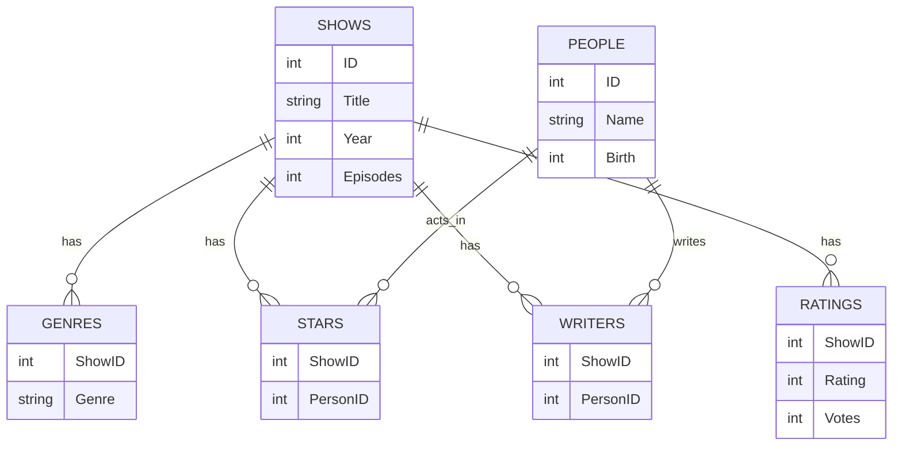

# TV Show Database Design

```mermaid
erDiagram
    SHOWS {
        int ID
        string Title
        int Year
        int Episodes
    }
    PEOPLE {
        int ID
        string Name
        int Birth
    }
    GENRES {
        int ShowID
        string Genre
    }
    STARS {
        int ShowID
        int PersonID
    }
    WRITERS {
        int ShowID
        int PersonID
    }
    RATINGS {
        int ShowID
        int Rating
        int Votes
    }

    SHOWS ||--o{ GENRES : has
    SHOWS ||--o{ STARS : has
    SHOWS ||--o{ WRITERS : has
    SHOWS ||--o{ RATINGS : has
    PEOPLE ||--o{ STARS : acts_in
    PEOPLE ||--o{ WRITERS : writes
```
